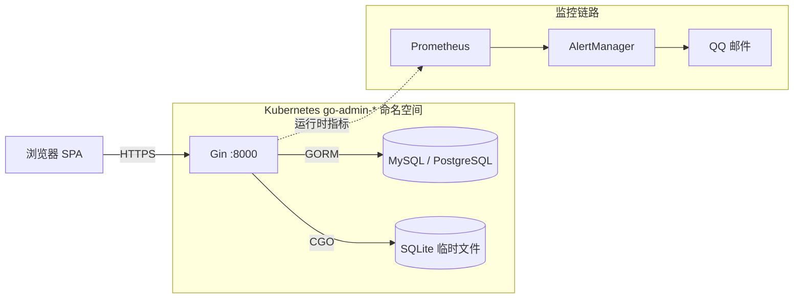

# go-admin

go-admin 平台的后端服务。Fork 自 [go-admin-team/go-admin](https://github.com/go-admin-team/go-admin)，改造后适配 ArgoCD 多环境部署。

- 语言：Go 1.24
- Web 框架：Gin
- ORM：GORM（MySQL / PostgreSQL / SQLite）
- 权限：Casbin RBAC
- 默认端口：`:8000`（HTTP）/ `:4194`（Go runtime 指标）

## 运行时架构



Pod → Prometheus 用的是 `kube-prometheus-stack` 自带的 PodMonitor，按 `:4194/metrics` 自动发现，不需要手写 ServiceMonitor。

## 目录结构

```
cmd/                     Cobra 入口（server / migrate / config / app / version）
app/                     业务模块（admin / jobs / other）
common/                  共享代码（middleware / database / global / dto）
config/                  运行配置（settings.yml）
docs/swagger/            自动生成的 Swagger 文档
docs/monitoring/         PrometheusRule + AlertManager + 压测脚本
template/                CRUD 代码生成器模板
static/                  静态资源
Dockerfile               多阶段构建（见下）
.github/workflows/ci.yml CI 流水线（lint → test → build → gitops-bump）
```

## Docker 构建

多阶段 Dockerfile，BuildKit 缓存挂载 `go mod` 和 `go-build`：

```dockerfile
# syntax=docker/dockerfile:1.7
FROM golang:1.24-bookworm AS builder
WORKDIR /src
COPY go.mod go.sum ./
RUN --mount=type=cache,target=/go/pkg/mod \
    --mount=type=cache,target=/root/.cache/go-build \
    go mod download
COPY . .
RUN --mount=type=cache,target=/go/pkg/mod \
    --mount=type=cache,target=/root/.cache/go-build \
    CGO_ENABLED=1 go build -tags sqlite3 -trimpath \
    -ldflags="-s -w" -o /out/go-admin .

FROM debian:bookworm-slim
RUN apt-get install -y --no-install-recommends ca-certificates tzdata
COPY --from=builder /out/go-admin /app/go-admin
```

最终镜像约 86 MB。SQLite 走 `CGO_ENABLED=1`，所以没选 Alpine（musl + glibc 不兼容是直接原因）。`-trimpath -ldflags="-s -w"` 去掉符号表。

## CI

`.github/workflows/ci.yml` 在每次 push 时跑四阶段：

| 阶段          | 工具                      | 失败行为 |
|---------------|---------------------------|----------|
| `lint`        | `go vet`                  | 阻塞     |
| `test`        | `go test -race -cover`    | 阻塞     |
| `build`       | `docker buildx`           | 阻塞     |
| `gitops-bump` | `yq` 修改 Helm `image.tag` | 警告，不阻塞 |

缓存：Go 模块（`/go/pkg/mod`）+ Docker 层缓存（`type=gha,mode=max`）。冷启动约 3 分钟，热启动约 30 秒（GitHub-hosted runner 上）。

镜像推送到阿里云 ACR，打两个 tag：不可变的 `sha-<short>` 和浮动的 `latest`。`sha-` 这个 tag 是 `infra-gitops` 实际消费的。

## 部署

这个仓库不含 Helm chart。详见 [infra-gitops](https://github.com/AmazingYe-oss/infra-gitops)，ArgoCD ApplicationSet 在那里把镜像部署到 `go-admin-dev`、`go-admin-staging`、`go-admin-prod`。

每次 `main` 上的 CI 都会触发 `gitops-bump`，去更新 `infra-gitops/go-admin-chart/values-*.yaml` 里的 `image.tag`。ArgoCD 在 30-60 秒内自动同步。

## 本地开发

```bash
git clone https://github.com/AmazingYe-oss/go-admin.git
cd go-admin

# SQLite（默认，不依赖外部服务）
go run main.go migrate
go run main.go server          # 监听 :8000

# MySQL
# 改 config/settings.yml -> DriverName=mysql + DSN，再跑同样的两条命令
```

默认账号：`admin / 123456`。上线前务必改掉。

## 监控

告警规则和压测脚本在 `docs/monitoring/` 下，完整链路（Pod → cAdvisor → Prometheus → PrometheusRule → AlertManager → QQ SMTP）见 [`docs/monitoring/MONITORING-ALERTING.md`](./docs/monitoring/MONITORING-ALERTING.md)。

复现端到端告警：

```bash
export KUBECONFIG=$HOME/.kube/config-k3s-cloud
kubectl apply -f docs/monitoring/demo-alert.yaml
kubectl apply -f docs/monitoring/am-alertmanager.yaml
bash docs/monitoring/bench-alert.sh
```

## 已知局限

- 只接了 SQLite 一种驱动，`pgx` 和 `mongo` 还没接。
- 没有 `/healthz` 和 `/readyz`，readiness 现在是纯 TCP（见 Helm chart 的 `readinessProbe`）。
- 暴露的指标只有 Go runtime（`expvar`）和 gin 中间件，业务自定义指标还没加。

## 相关仓库

| 仓库 | 作用 |
|------|------|
| [go-admin-ui](https://github.com/AmazingYe-oss/go-admin-ui) | 前端 SPA，跟这个服务一起部署 |
| [infra-gitops](https://github.com/AmazingYe-oss/infra-gitops) | ArgoCD + Helm 配置，镜像 tag 的单一可信源 |

## License

MIT