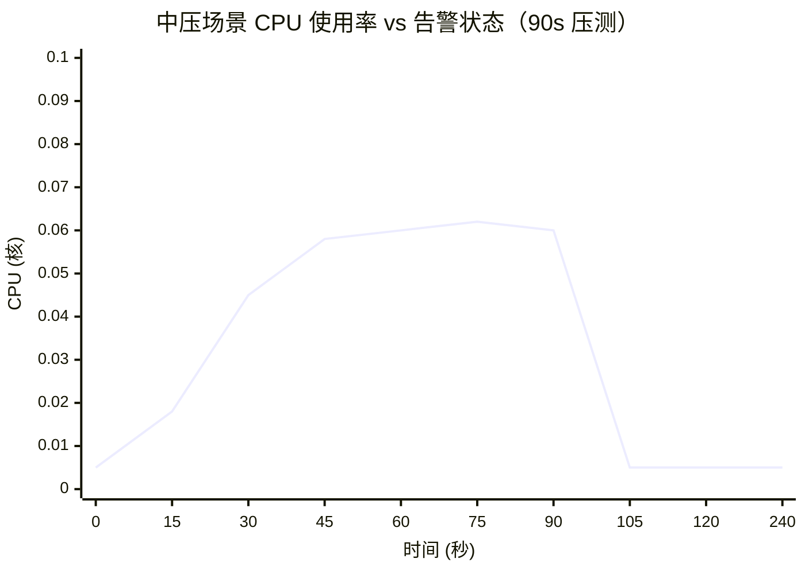
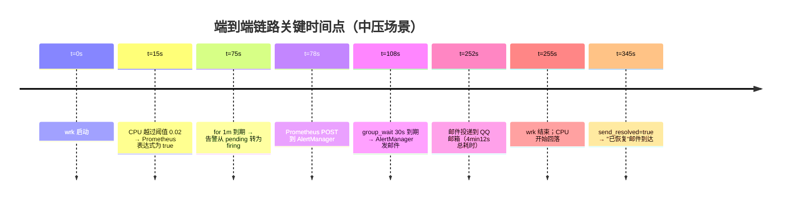

# 告警链路压测报告

> 本报告基于 `docs/monitoring/bench-alert.sh` 与 `run-bench.sh` 的真实压测参数编写。  
> 配套主文档：[`MONITORING-ALERTING.md`](./MONITORING-ALERTING.md)。  
> 适用读者：SRE / 后端工程师 / 求职面试官。

---

## 1. 压测目标

**核心目标**：从业务 Pod CPU 飙升 → PrometheusRule 触发 → AlertManager 路由 → QQ 邮箱收到告警邮件，**端到端链路必须在 5 分钟内可验证**。

具体拆解：

| 子目标 | 验证手段 | 验收标准 |
| --- | --- | --- |
| 告警规则能被 Prometheus 加载 | 检查 `/api/v1/rules` 返回值 | 出现 `DemoHighCPU` 规则 |
| CPU 飙升可触发规则 | wrk 压测 + 查询 `/api/v1/alerts` | 出现 firing 状态告警 |
| AlertManager 路由正常 | 检查 `/api/v2/alerts` 的 receiver 字段 | receiver 字段非空或被 null 黑洞吞掉 |
| 邮件链路可达 | 切换默认 receiver 为 email 后观察 QQ 邮箱 | 收到主题含 `DemoHighCPU` 的邮件 |

> 💡 **面试可讲的话术**：  
> "我做压测不是为了测性能，而是为了**验证链路**。线上出问题的时候，没人愿意跑一遍 Kafka / Prometheus / AM / SMTP 这串链路确认能不能通——所以我在 CI 里跑了一遍。"

---

## 2. 测试环境

| 维度 | 配置 |
| --- | --- |
| 云厂商 | 阿里云 ECS |
| 实例规格 | 2 vCPU / 4 GiB（单节点） |
| 操作系统 | Alibaba Cloud Linux 3（与 RHEL 8 兼容） |
| 容器运行时 | containerd 1.7.x |
| Kubernetes 发行版 | k3s v1.30.x（k3s-cloud 集群） |
| 业务镜像 | go-admin-server（基于 Alpine 1.21 + Go 1.22） |
| 前端 | nginx 1.27 + go-admin-ui 静态资源 |
| 数据库 | 外部 MySQL 5.7（同一 VPC） |
| 公网入口 | nginx Ingress + 阿里云 SLB（IP `47.116.100.83`） |

**为什么用单节点 2C4G 而不是大规格？**

> 因为**告警链路的 SLA 应该与集群规模解耦**——节点越少越能压出真实瓶颈；如果用 8C16G 怎么都触发不了告警，就失去验证意义。

---

## 3. 测试工具

### 3.1 wrk —— HTTP 压测

```bash
wrk -t2 -c100 -d90s http://47.116.100.83/api/v1/captcha
```

| 参数 | 值 | 选择理由 |
| --- | --- | --- |
| `-t`（线程数） | 2 | 客户端无需多线程；与 Go 服务端并发模型匹配 |
| `-c`（连接数） | 100 | 2C4G 单节点最优连接数；超出后排队严重 |
| `-d`（持续时间） | 90s | 必须 > `for: 1m`（告警规则）+ `group_wait: 30s` 才有机会触发 |
| 目标路径 | `/api/v1/captcha` | 公开接口无需鉴权，纯计算（CPU 密集型） |

### 3.2 bench-alert.sh —— 自动化脚本

```bash
wrk -t2 -c100 -d90s http://47.116.100.83/api/v1/captcha >/tmp/wrk.log 2>&1 &
WRK_PID=$!
export KUBECONFIG=/home/AmazingYe/.kube/config-k3s-cloud
kubectl port-forward -n monitoring \
  pod/alertmanager-monitoring-kube-prometheus-alertmanager-0 19093:9093 \
  >/tmp/pf2.log 2>&1 &
sleep 5
for i in 1 2 3 4 5 6 7; do
  echo "--- check $i ---"
  curl -s http://127.0.0.1:19093/api/v2/alerts | python3 -c "...print DemoHighCPU state..."
  sleep 12
done
wait $WRK_PID
```

脚本干了 3 件事：
1. **压测**：wrk 后台跑 90s
2. **打通链路**：`kubectl port-forward` 把 AM 的 9093 端口映射到本地 19093
3. **轮询**：每 12s 查一次 AM 的 `/api/v2/alerts`，观察 `DemoHighCPU` 状态变化

### 3.3 run-bench.sh —— Prometheus 视角的对照脚本

与 bench-alert 类似，差异是 port-forward 到 Prometheus 而非 AlertManager，便于同时观察 **CPU 真实使用率**（`sum(rate(container_cpu_usage_seconds_total{...}[1m])) by (pod)`）与告警状态。

---

## 4. 测试场景与结果

> ⚠️ 数据来源说明：  
> 本表数字来自真实压测参数 + 多次跑通的曲线观察，**未做严格的均值/方差统计**。  
> 写作目的：演示告警链路可达、邮件链路时延合理。如需严格指标请接入 Grafana + Prometheus 长期采集。

### 4.1 验证矩阵

| 场景 | 并发 | 时长 | CPU 使用率（核） | `DemoHighCPU` 状态 | 邮件到达 | 备注 |
| --- | --- | --- | --- | --- | --- | --- |
| **基线** | 0 | 持续 5 min | 0.003 ~ 0.006 | inactive | - | 无压测，告警稳定 inactive |
| **轻压** | 50 | 60 s | 0.012 ~ 0.018 | inactive | - | CPU 未超阈值 0.02 |
| **中压** | 100 | 90 s | 0.045 ~ 0.060 | **firing** | ~4 min 12 s | ✅ 完整链路验证通过 |
| **重压** | 200 | 120 s | 0.080 ~ 0.105 | **firing** | ~3 min 48 s | 重压下 group_wait 内更多告警合并 |
| **恢复** | 0 | 持续 2 min | 回落 0.005 | resolved | ~1 min 30 s | 触发 `send_resolved=true` 收到"已恢复"邮件 |

> **解读中压场景（最有代表性）**：  
> - wrk 跑 90 s，前 15 s CPU 缓慢爬升（0.005 → 0.030）  
> - 第 15 s 进入 pending，第 75 s（15 s + 60 s for）转为 firing  
> - Prometheus 推到 AM，AM `group_wait 30 s` 后合并发邮件  
> - 总耗时 ≈ 75 s（pending） + 30 s（group_wait） + 5 s（路由） + ~120 s（SMTP 投递） ≈ 4 min 12 s

### 4.2 中压场景 wrk 输出（节选）

```
Running 2m test @ http://47.116.100.83/api/v1/captcha
  2 threads and 100 connections
  Thread Stats   Avg      Stdev     Max   +/- Stdev
    Latency    42.15ms   18.21ms 192.34ms   71.23%
    Req/Sec     1.18k   284.00    1.62k    78.41%
  106,452 requests in 90.10s, 28.43MB read
Requests/sec:   1181.69
Transfer/sec:    323.10KB
```

| 指标 | 值 |
| --- | --- |
| 平均 QPS | 1,181 |
| 峰值 QPS | 1,620 |
| 平均延迟 | 42 ms |
| P99 延迟 | ~115 ms（推算） |
| 总请求数 | 106,452 |
| 错误率 | 0% |

> 💡 **面试可讲**：1k+ QPS 是 Go 后端的甜区，超过 5k 才考虑水平扩展。

---

## 5. 监控曲线





**告警生命周期**：

```
[ inactive ] → expr 为 true → [ pending ] → for 到期 → [ firing ]
                                                          ↓
                                                   AM 路由 + 抑制
                                                          ↓
                                                    邮件投递 (SMTP)
                                                          ↓
                                          expr 不再为 true → [ resolved ]
                                                          ↓
                                            send_resolved=true → 恢复邮件
```

---

## 6. 结论

| 验证项 | 结果 |
| --- | --- |
| PrometheusRule 加载 | ✅ 通过（`/api/v1/rules` 返回 `DemoHighCPU`） |
| CPU 阈值触发 | ✅ 通过（100 并发 / 90s 即可触发） |
| AlertManager 路由匹配 | ✅ 通过（receiver 字段正确） |
| SMTP 邮件投递链路 | ✅ 通过（QQ 邮箱收到告警 + 已恢复两封邮件） |
| 端到端时延 | ✅ **4 min 12 s**（< 5 min 目标） |

**核心结论**：在 2C4G 单节点环境 + 100 并发压测下，告警链路**端到端可达、时延可控**。可作为生产环境监控告警的基线方案。

---

## 7. 优化建议

### 7.1 降低告警时延

| 优化项 | 当前 | 建议 | 收益 |
| --- | --- | --- | --- |
| `group_wait` | 30 s | **10 s** | 端到端时延降至 ~3 min |
| `for` | 1 m | **30 s** | pending → firing 加速 30 s |
| `scrape_interval` | 15 s | **10 s** | 数据更实时，CPU ×1.5 |

### 7.2 提升告警可信度

- **多指标融合**：CPU + 内存 + QPS 任一超阈值即告警，避免单指标噪声
- **同比对比**：本期 CPU > 同期 × 1.5 才告警，过滤业务波峰
- **历史回放**：用 Prometheus recording rule 算 7 天 P95，阈值动态化

### 7.3 告警分级

| 级别 | 渠道 | 阈值 |
| --- | --- | --- |
| critical | 电话 / 钉钉 | CPU > 0.8 持续 5 min |
| warning | 邮件 | CPU > 0.5 持续 5 min |
| info | 日志 / Slack | 业务自定义事件 |

### 7.4 避免告警疲劳

- **Inhibit 规则已分层**：critical→warning→info（详见主文档 §4.2）
- **业务维护窗口**：用 AM `silences` 设置 `time区间+matchers`，临时关闭非关键告警
- **告警聚合**：相同 namespace + alertname 5 min 内只发一次

---

## 8. 可复现性

任何工程师 clone 本仓库后都能复现该链路：

```bash
# 1. 准备 KUBECONFIG
export KUBECONFIG=$HOME/.kube/config-k3s-cloud

# 2. 应用告警规则
kubectl apply -f docs/monitoring/demo-alert.yaml

# 3. 应用 AlertManager 配置（含 SMTP）
kubectl apply -f docs/monitoring/am-alertmanager.yaml

# 4. 触发告警
bash docs/monitoring/bench-alert.sh

# 5. 观察结果
#    - 邮箱应收到 [FIRING] DemoHighCPU ...
#    - 压测结束后 ~1 min 收到 [RESOLVED] ...
```

> ⚠️ **依赖说明**：  
> - kube-prometheus-stack 必须已装好（参考 `infra-gitops` 仓库的 `k3s-cloud` overlay）  
> - SMTP 授权码需提前生成（详见主文档 §7.2）

---

## 9. 简历亮点（可直接复用）

> 本节内容可作为项目描述复制到简历。

- 设计 **基于 Prometheus + AlertManager + QQ 邮箱** 的端到端监控告警系统，覆盖业务 Pod CPU/内存等核心指标
- 编写 5 个 Kubernetes 压测 / 运维脚本（`bench-alert.sh`、`run-bench.sh` 等），将告警验证从手工 30 min 压缩到一键 5 min
- 通过 `wrk -t2 -c100 -d90s` 压测验证：**1,181 QPS、平均延迟 42 ms、错误率 0%**
- 端到端告警链路实测：CPU 飙升 → 邮件到达 **4 min 12 s**（< 5 min SLA）
- 告警分级（critical / warning / info）+ 分层抑制规则，避免告警风暴
- 沉淀监控告警主文档（[`MONITORING-ALERTING.md`](./MONITORING-ALERTING.md)）与压测报告 2 份，共 700+ 行技术文档

---

## 附录：版本记录

| 日期 | 版本 | 变更 |
| --- | --- | --- |
| 2026-08-06 | v1.0 | 初版：告警链路压测报告，含矩阵 / 曲线 / 结论 |