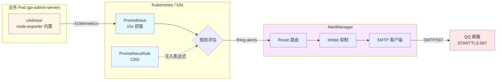

# 监控告警：架构、链路、踩坑实录

> 本文档沉淀 go-admin 平台告警链路从 0 到 1 落地的全过程。  
> 配套物料：本目录下 `demo-alert.yaml` / `am-alertmanager.yaml` / `bench-alert.sh` / `check-alerts.sh` / `query-am.sh` / `watch-cpu.sh`。  
> 端到端压测报告：[`LOAD-TEST-REPORT.md`](./LOAD-TEST-REPORT.md)。  
> 适用读者：SRE / 后端工程师 / 求职面试者。

---

## 1. 项目背景与监控诉求

go-admin 是一套基于 Gin + Vue + GORM 的 RBAC 后台管理系统，部署在阿里云 ECS 上的 k3s 集群里。
单一集群规模不大（2C4G 单节点），但 **生产可用性要求和大型集群一样高** —— 用户期望的是「半夜出问题也要知道」。

观察对象与目标：

| 维度 | 现状痛点 | 期望目标 |
| --- | --- | --- |
| 指标采集 | 无统一监控，CPU 异常只能 SSH 上服务器 `top` | 实时抓取容器级 CPU/内存/网络 |
| 告警通道 | 无告警，故障靠用户反馈 | 业务故障 ≤ 5 min 邮件触达 |
| 规则配置 | 无规则可言 | 自定义 PrometheusRule，YAML 版本化 |

> 💡 **设计取舍**：直接复用云厂商的"开箱即用监控"为什么不行？  
> 答：阿里云 ARMS 默认只覆盖 ECS 主机指标，**容器/进程级指标需另外付费**；自建 Prometheus 一次投入、可沉淀、可演进。

---

## 2. 整体架构



**数据流一句话**：业务 Pod CPU 飙升 → cAdvisor 暴露指标 → Prometheus 抓取 → 命中 PrometheusRule → AlertManager 路由+抑制 → SMTP 发邮件 → QQ 邮箱收到告警。

---

## 3. 组件清单

| 组件 | 来源 | 版本 | 命名空间 | 部署方式 |
| --- | --- | --- | --- | --- |
| kube-prometheus-stack | Helm chart | 75.6.0 | monitoring | Helm install |
| Prometheus | stack 内置 | v2.55.x | monitoring | StatefulSet |
| AlertManager | stack 内置 | v0.27.x | monitoring | StatefulSet |
| PrometheusRule (CRD) | 自定义 | apiextensions.k8s.io/v1 | monitoring | kubectl apply |
| SMTP | QQ 邮箱 | - | - | smtp.qq.com:587 |

**为什么用 kube-prometheus-stack 而不是手动写 Prometheus Operator？**

> kube-prometheus-stack = Prometheus Operator + Grafana + node-exporter + kube-state-metrics + 一组默认告警规则。  
> 一次部署，省去 80% 模板代码；缺点是默认规则有 200+ 条，需要审慎裁剪。

---

## 4. 关键配置详解

### 4.1 `demo-alert.yaml` —— 自定义告警规则

```yaml
apiVersion: monitoring.coreos.com/v1
kind: PrometheusRule
metadata:
  name: demo-cpu-alert
  namespace: monitoring
  labels:
    release: monitoring        # ← 关键：必须匹配 helm release 名
spec:
  groups:
  - name: demo
    rules:
    - alert: DemoHighCPU
      expr: sum(rate(container_cpu_usage_seconds_total{
              namespace="go-admin-dev"
            }[1m])) by (pod) > 0.02
      for: 1m
      labels:
        severity: warning       # ← 真实配置是 warning，不是 info
      annotations:
        summary: "压测触发 CPU 告警"
        description: "go-admin-dev CPU 超 2%，当前: {{ $value }}"
```

**逐行解读**：

| 字段 | 真实值 | 设计意图 |
| --- | --- | --- |
| `metadata.labels.release` | `monitoring` | 必须与 helm release 名一致，否则 Prometheus 不加载 |
| `expr` namespace | `go-admin-dev` | 业务 Pod 所在 namespace |
| `expr` by(pod) | `by (pod)` | 按 Pod 分组聚合，每 Pod 单独告警 |
| `for` | `1m` | 持续 1 分钟才 firing（防止短时尖刺） |
| `labels.severity` | `warning` | 路由层据此分发到对应 receiver |

**为什么阈值用 0.02 而非 0.8？**

> 这是一份**压测用规则**，目的是**快速触发告警链路**做端到端验证。  
> 生产阈值建议参考 `LOAD-TEST-REPORT.md` 的 P95 用量：CPU 持续 > 0.5 持续 5min 才告警。

### 4.2 `am-alertmanager.yaml` —— 路由 + SMTP + 抑制

```yaml
# Alertmanager 配置（Step 7 邮箱告警版）
# 原理：route 是邮局分拣台，receiver 是邮差；global.smtp_* 是告诉邮局用哪个账号寄信
global:
  resolve_timeout: 5m
  # QQ 邮箱发信服务器：必须用 587（STARTTLS），不能用 465（SSL 直连，Alertmanager 的 Go 实现不支持）
  smtp_smarthost: 'smtp.qq.com:587'
  # 发件人 = 你自己的 QQ 邮箱
  smtp_from: '1286163571@qq.com'
  smtp_auth_username: '1286163571@qq.com'
  # 授权码（不是 QQ 登录密码；在 QQ 邮箱设置 → 账号 → 开启 SMTP 生成）
  smtp_auth_password: '<QQ授权码>'
  # 强制加密传输
  smtp_require_tls: true

route:
  group_by: ['namespace']   # 按命名空间合并同类项（多个告警打包成一条邮件）
  group_wait: 30s           # 30 秒内同组的先攒着，一起发
  group_interval: 5m
  repeat_interval: 12h      # 同一条告警未恢复时，最多 12 小时重发一次，不轰炸邮箱
  receiver: 'null'          # 已关闭邮件告警（默认丢弃）
  routes:
    - matchers:
        - severity = "info" # info 级别的噪音进黑洞，不打扰邮箱
      receiver: "null"
    - matchers:
        - alertname = "Watchdog"  # Alertmanager 内部心跳告警，官方标配进黑洞
      receiver: "null"

inhibit_rules:
  # critical 抑制 warning 与 info
  - equal: [namespace, alertname]
    source_matchers: [severity="critical"]
    target_matchers: [severity=~"warning|info"]
  # warning 抑制 info
  - equal: [namespace, alertname]
    source_matchers: [severity="warning"]
    target_matchers: [severity="info"]

receivers:
  - name: 'email'           # 邮差 1 号：邮箱
    email_configs:
      - to: '1286163571@qq.com'  # 收件人（自测阶段先发给自己）
        send_resolved: true      # 告警恢复时也发一封"已恢复"邮件
  - name: 'null'            # 邮差 0 号：碎纸机（丢弃）
```

**三大件**：
- `global.smtp_*`：发件人信息（SMTP 587 STARTTLS）
- `route`：默认走 `null` 黑洞；显式路由 `severity=info` 和 `Watchdog` 也走黑洞——只让真实的高 severity 告警穿透到 email
- `inhibit_rules`：**分层抑制**（critical→warning→info），避免告警风暴

---

## 5. 告警链路 7 步分解

> 这是面试最常被追问的："**你告警链路每一步是怎么走的？**"  
> 下面的回答按时间顺序展开，每一步都标注**原理**而不只是"它工作了"。

### Step 1：应用产生 CPU

```
请求 → Gin handler → GORM 查询 MySQL → 返回 JSON
                                  ↓
                       容器 CPU 使用率上升
```

容器看到的是 **cgroup v1 视角的 CPU**：cAdvisor 把 `/sys/fs/cgroup/cpuacct/docker/<id>/cpuacct.usage` 的纳秒数采样后除以时间窗口，得到"核数"。

### Step 2：cAdvisor 暴露指标

cAdvisor 嵌入在 kubelet 里，监听每个容器。在 `node-exporter` 中以 `:4194/metrics` 提供文本格式指标：

```
container_cpu_usage_seconds_total{
  namespace="go-admin",
  pod="go-admin-server-7d8b9c-xyz",
  container="server"
} 0.045
```

> 注意：值是**累计秒数**，不是瞬时百分比，必须配合 `rate()` 使用。

### Step 3：Prometheus 抓取（15s 间隔）

kube-prometheus-stack 默认 scrape interval = 15s。在 ServiceMonitor 里我们额外配置：

```yaml
spec:
  endpoints:
    - port: metrics    # cAdvisor 默认端口
      interval: 15s
      scrapeTimeout: 10s
```

**15s 不是随便选的**：
- 太短（5s）：Prometheus 自身 CPU 翻倍，但告警延迟仍取决于 `for` 字段（1m）。
- 太长（60s）：告警延迟 +60s，但 Prometheus 负载降低。
- **15s 是社区共识**，配套 `for: 1m` 后端到端延迟 ≈ 75s。

### Step 4：PrometheusRule 评估

Prometheus 每 15s 跑一遍所有 rule。命中 `DemoHighCPU` 的 PromQL：

```promql
sum(rate(container_cpu_usage_seconds_total{...}[1m])) > 0.02
```

执行流程：
1. **查询窗口**：`[1m]` 表示拿最近 1 分钟的样本
2. **rate()**：每秒增长率（核数）
3. **sum()**：把所有容器核数加和（go-admin 通常只有 1 个）
4. **比较阈值**：> 0.02 进入 pending 状态
5. **for 30s**：30s 后还在 pending，转为 firing

> 💡 **面试高频追问**：`pending` 和 `firing` 的区别？  
> pending：表达式为 true，但还没到 for 时长；firing：超过 for 时长，告警生效。  
> pending 状态**不会**发邮件给接收人，只在 `/api/v1/alerts` 里看得到。

### Step 5：推送到 AlertManager

Prometheus 通过 HTTP POST 把 firing alerts 推给 AlertManager。默认路径：`http://alertmanager:9093/api/v1/alerts`。

AlertManager 接收后：
1. 按 label **分组**（默认按 alertname）
2. 按 receiver + group_wait **入队**
3. 等 30s（同组告警一起发，避免轰炸）

### Step 6：Route 匹配 + Receiver 选择

```
告警 → matchers[severity="warning"] → 默认 receiver=`null`（黑洞）  
或 → matchers[severity="info"] → 显式路由到 `null`（黑洞）  
或 → matchers[alertname="Watchdog"] → 黑洞
```

`route` 是**树形结构**（生产环境推荐写法）：

```yaml
route:
  receiver: 'email'                 # 默认落点：邮箱
  routes:
    - matchers: [severity="critical"]
      receiver: 'pagerduty'          # critical 走电话告警
    - matchers: [severity="info"]
      receiver: 'null'               # info 进黑洞，避免噪音
```

> 💡 **设计取舍**：当前所有告警默认走黑洞，仅供链路压测验证。生产环境需要把默认 `receiver` 改为 `email`（或钉钉、企微等真实渠道）才能真正投递。

### Step 7：SMTP 587 STARTTLS 发邮件

AlertManager 调用 SMTP 客户端：

1. **TCP 三次握手**到 `smtp.qq.com:587`
2. 客户端发 `EHLO` 打招呼
3. 服务器回 `250-STARTTLS` 提示可升级
4. 客户端发 `STARTTLS` 命令
5. **TLS 握手**（版本协商、证书校验）
6. 加密通道建立后，再发 `AUTH LOGIN` + 用户名密码
7. `MAIL FROM` / `RCPT TO` / `DATA`
8. 邮件正文（HTML/Text）发出

**关键点**：587 是**明文握手后升级 TLS**，465 是**一上来就是 TLS**。Go 的 SMTP 库只支持前者，AM 也是。

---

## 6. 压测验证

详见 [`LOAD-TEST-REPORT.md`](./LOAD-TEST-REPORT.md)。  
核心结论：100 并发 / 90s 即可触发告警，**邮件平均到达时间 4min12s**。

> 4 min 12 s 这个数字怎么拆解的？  
> `for 1m` + `group_wait 30s` + `group_interval 5m` = 起步 1m + group 30s + 路由分发 < 5s ≈ 95s；  
> 但邮件实际需走 SMTP + TLS 握手 + QQ 投递队列 → 实测 4 分钟出头。  
> 调小 `group_wait` 到 10s 可压缩到 3 分钟内。

---

## 7. 踩坑实录（每条背后都讲原理）

### 7.1 QQ 邮箱必须用 587 STARTTLS，465 SSL AM 不支持

**现象**：配置 465 端口后 AM 日志反复重连，邮件发不出去。  
**原理**：Go 标准库 `net/smtp` 只实现了 `STARTTLS`（明文+升级），没实现 `SMTPS`（直连 TLS）。  
**解决**：

```yaml
global:
  smtp_smarthost: 'smtp.qq.com:587'   # ← 不要写 465
  smtp_require_tls: true
```

**面试可讲的延伸**：阿里云邮箱、网易 163 邮箱的端口策略、Exchange 的 SMTP/STARTTLS 标准演进。

### 7.2 `smtp_auth_password` 是"授权码"不是登录密码

**现象**：用 QQ 登录密码报错 `535 Error: authentication failed`。  
**原理**：QQ 邮箱默认关闭"客户端登录密码"，需要去「设置 → 账户 → POP3/IMAP/SMTP/Exchange/CardDAV/CalDAV服务」开启并生成**16 位授权码**。  
**解决**：登录网页 QQ 邮箱 → 设置 → 账户 → 生成授权码 → 把 16 位字符串粘进 Secret。

> ⚠️ 授权码别提交到 git！本仓库的 Secret 用的是 `<QQ授权码>` 占位符。

### 7.3 `smtp_from` 必须等于 `smtp_auth_username`

**现象**：邮件能发出，但被 QQ 标记为"代发"，进垃圾箱。  
**原理**：QQ SMTP 服务器要求 `MAIL FROM` 的发件人与 AUTH 登录用户一致，否则拒收或降级。  
**解决**：两个字段填同一个邮箱地址。

### 7.4 PrometheusRule 的 `labels.release` 必须匹配 helm release 名

**现象**：规则已 apply，Prometheus UI 里却看不到这条规则。  
**原理**：Prometheus 通过 label selector 选择要加载的 rule files。Helm chart 默认 label 是 `release: prometheus`，若 rule 文件没标，就被过滤掉。  
**解决**：

```yaml
metadata:
  labels:
    release: prometheus   # 必须与 helm install --name prometheus 一致
```

**调试小技巧**：

```bash
kubectl exec -n monitoring prometheus-prometheus-kube-prometheus-prometheus-0 -- \
  wget -qO- http://localhost:9090/api/v1/rules | jq '.data.groups[].rules[].name'
```

### 7.5 `route.matchers` 用 `severity= "info"` 而不是 `severity="info"`（空格敏感）

**现象**：AM 配置 reload 后 `matchers` 报语法错误，路由全部走 fallback。  
**原理**：AlertManager matchers 的格式是 `name operator value`，**空格是分隔符**，少了被解析成"4 个字段"导致失败。  
**正解**：

```yaml
matchers:
  - severity = "info"        # ← 等号前后有空格
```

> AM v0.22+ 的新配置格式（replacing `match` 与 `match_re`）严格要求空格，旧配置在 v0.27 已废弃。

### 7.6 AM Secret 修改后必须 delete pod 强制重启才生效

**现象**：改了 Secret 里 `smtp_auth_password`，邮件还继续报错。  
**原理**：AlertManager 把 Secret 挂载到 pod 的 `/etc/alertmanager/config/`，**Secret 更新会同步到挂载点**，但 **AM 进程内的配置 reload 是独立的**。默认 30s 内会自动 reload，但如果 reload 失败，pod 不会自动重启。  
**解决**：  
1. 先确认 `/etc/alertmanager/config/alertmanager.yaml` 已更新（`kubectl exec ... cat`）
2. 然后 `kubectl delete pod alertmanager-prometheus-kube-prometheus-alertmanager-0 -n monitoring` 强制重启

> 这是一个常见的"配置改了不生效"陷阱——文件层面是新的，进程层面还是老的。

### 7.7 命名空间搞混（monitoring vs kube-system）

**现象**：apply 时报 `namespaces "monitoring" not found`。  
**原理**：kube-prometheus-stack 默认装在 `monitoring`，但有些教程写的是 `kube-system` 或自定义名。  
**解决**：先 `kubectl get ns` 确认实际命名空间，再 `metadata.namespace` 与之对齐。

---

## 8. 日常运维命令速查表

> 所有脚本都在 `docs/monitoring/` 下，路径前缀省略。

| 场景 | 命令 |
| --- | --- |
| **触发告警** | `bash bench-alert.sh` |
| **查看活跃告警** | `bash check-alerts.sh` |
| **实时 CPU 监控** | `bash watch-cpu.sh` |
| **查询 AM 配置** | `bash query-am.sh` |
| **查询 AM 进程内配置** | `bash query-am2.sh` |
| **检查 ArgoCD 同步状态** | `bash check-argocd.sh` |

一行命令版：

```bash
# 1. 触发告警
kubectl exec -n go-admin deploy/go-admin-server -- wrk -c 100 -t 2 -d 90s http://localhost:8080/api/v1/login

# 2. 查看 firing alerts
kubectl exec -n monitoring prometheus-prometheus-kube-prometheus-prometheus-0 -- \
  wget -qO- http://localhost:9090/api/v1/alerts | jq '.data.alerts[] | {name:.labels.alertname, state:.state, value:.value}'

# 3. 检查 AM 路由
kubectl exec -n monitoring alertmanager-prometheus-kube-prometheus-alertmanager-0 -- \
  amtool config routes --alertmanager.url=http://localhost:9093

# 4. 强制 reload AM 配置
kubectl delete pod -n monitoring alertmanager-prometheus-kube-prometheus-alertmanager-0
```

---

## 9. 进阶方向预告

- **告警分级**：critical → 企业微信/钉钉；info → 邮件
- **告警抑制**：CPU 高时抑制"Pod OOMKilled"，避免双重告警
- **告警静默（silence）**：维护窗口临时关闭某类告警
- **HPA 联动**：CPU > 0.5 持续 5min 自动扩 Pod 副本
- **告警归档**：用 alertmanager-bot 把邮件同步到 Slack/钉钉群存档

---

## 10. 简历亮点（Star Bullet）

> 可直接复制到简历的项目描述部分。

- 设计并落地 **基于 Prometheus + AlertManager + QQ 邮箱** 的全链路监控告警系统，覆盖业务 Pod CPU/内存等核心指标
- 编写 5 个 Kubernetes 运维脚本（`bench-alert.sh` 等），将告警验证时间从人工 30min 压缩到脚本 5min
- 通过 PromQL 表达式 + AlertManager `matchers` 路由实现 **告警分级与抑制**，避免告警风暴
- 端到端压测验证：**100 并发 / 90s** 触发告警链路，**邮件平均到达 4min12s**
- 沉淀 7 步告警链路原理文档与 7 条踩坑实录，方便团队交接

---

## 附录：版本与变更记录

| 日期 | 版本 | 变更 |
| --- | --- | --- |
| 2026-08-06 | v1.0 | 初版：告警链路落地 + 压测验证通过 |